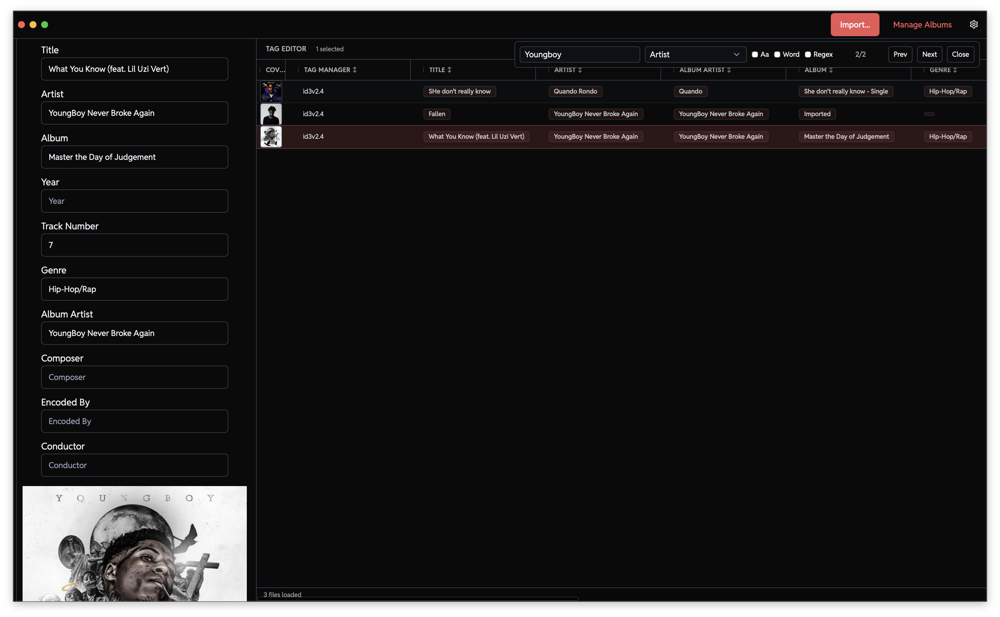
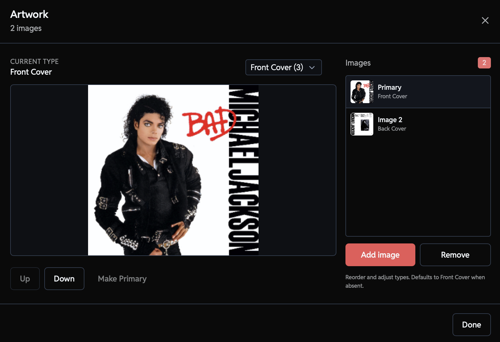
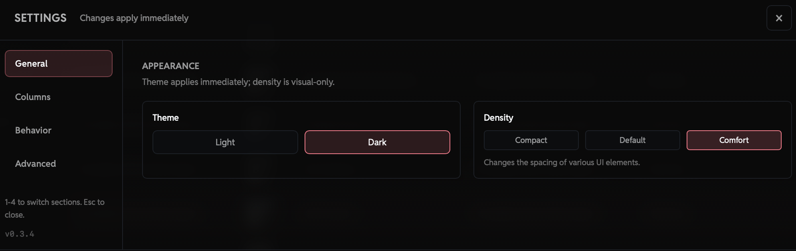
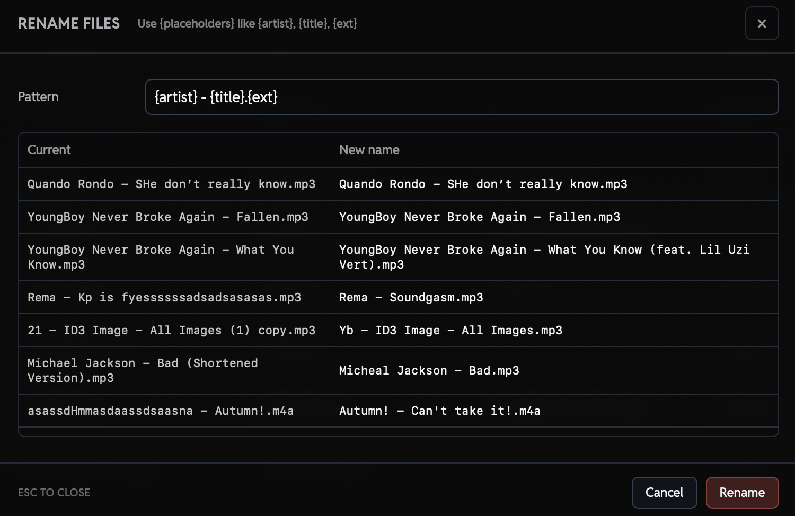

#  &nbsp; Audexis

Audexis is a modern, cross-platform audio metadata editor built with Tauri.  
It lets you edit tags, album artwork, and filenames quickly while staying lightweight and privacy-respecting.

It is designed for people who manage personal music libraries, DJ crates, podcast collections, or archived audio files.

## Documentation

You can view the documentation [here](https://www.audexis.app/docs)

## Screenshots

### Main interface

[](https://www.audexis.app)

### Tag and image editing

[](https://www.audexis.app)

### Settings

[](https://www.audexis.app)

### File renaming

[](https://www.audexis.app)

## Features

- Cross-platform (macOS and Windows)
- Fast, native performance using Tauri
- Batch editing for large sets of files
- Edit album artwork and embedded images
- Supports MP3, M4A/MP4, and FLAC
- Clean UI built with React and TailwindCSS
- Automatic updates
- Open source

## Installation

Download the latest release from:

https://github.com/kp-fyn/audexis/releases

Windows:

- `.msi` or `.exe`

macOS:

- `.dmg`

## Building From Source

### Requirements

- Node.js 22+
- Rust 1.90+
- pnpm

### Clone

```bash
git clone https://github.com/kp-fyn/audexis
cd audexis

```

### Install dependencies

```bash
pnpm install
```

### Build

```bash
pnpm --filter desktop tauri build
```

## Contributing

Contributions, bug reports, and feature suggestions are welcome.

Feel free to open an issue before submitting a pull request.

## Privacy

Audexis performs all metadata editing locally on your machine.
